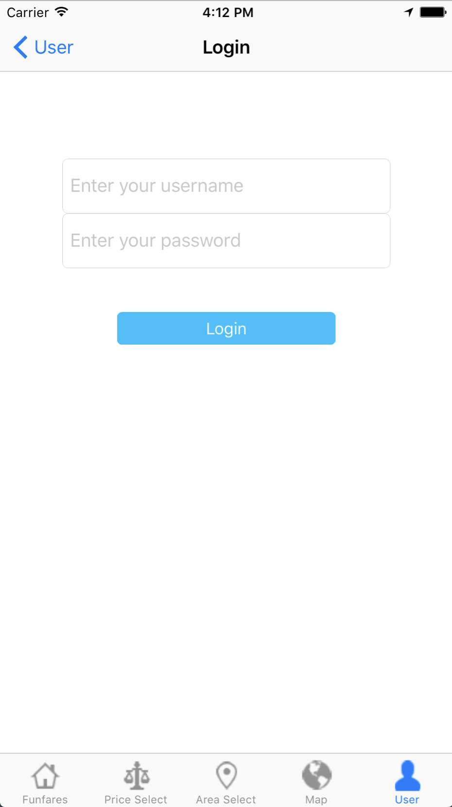

# Funfare

------

<table>
<tr>
<td>
A webapp using sails and Titanium API to build. The application supports web and ios platforms，helping people to buy travel package online.
</td>
</tr>
</table>

> ### Student Name:  Cheng Bo

> ### Student Id:    17433045

## 1. INTERFACE OF WEBSITE

###  Home Page
The home page will display all the travel packages, and users can click on the name of the site for detailed information.

### Details Page
This page shows the details of the scenic spots, and users can click on the blue button to order the package.

### Login Page
On this page, users enter the username and password  and log in.

### My Package Page
On this page, users can view their reserved travel packages.

### Search Page
On this page, users can search the scenic spots by the scenic spots, the price range, and the travel date.

- when search somethings

### Create Page
On this page, admin can create the travel package.

### Admin Page
The administrator can create and update travel packages on this page and get the list of subscribers for each tour package.

- Check result:

- If no one order this package.

### Login and Logout
- When no user login

- When customer login

- When admin login

- When user logout

## 2. INTERFACE OF APP
### App Icon

### Home Page
The home page will display all the travel packages, and users can click on the name of the site for detailed information.

### Details Page
This page shows the details of the scenic spots, and users can click on the blue button to order the package.

- booking confirm

- booking success

### Map Page
This page shows the location of the embassies of all scenic spots on the map

### Price Select Page
On this page, users can choose a tour package through the price ladder

### Area Select Page
On this page, the tourist package is classified according to the area, and the user can choose one of the details for APP.

### Login Page
On this page, users enter the username and password  and log in.

- when password error

### User Page
On this page, users can log in , log out , check booked package and check 'about us'.

- when user login

### Mypackage Page
On this page, users can view their reserved travel packages.

